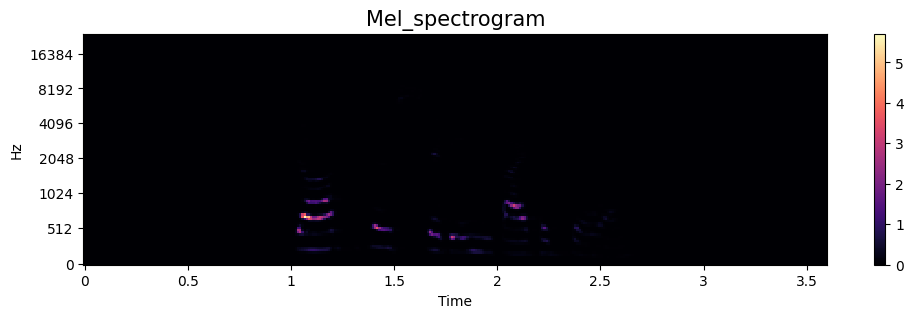
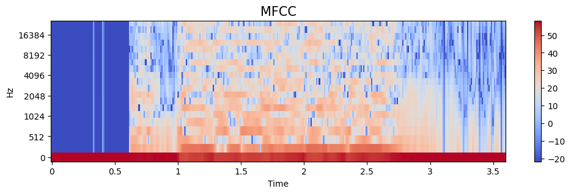
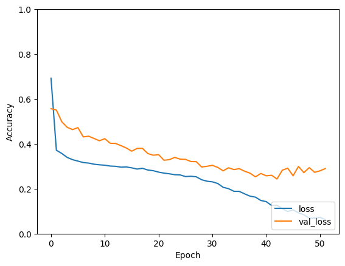

# 
 Speech Emotion Recognition (SER)

## 1. Title and Author
- Author: Pranay manikanta Narava
- Prepared for UMBC Data Science Master Degree Capstone by Dr Chaojie (Jay) Wang
- semester: Final semester
- GitHub: [https://github.com/NPranaya7?tab=repositories](https://github.com/DATA-606-2023-FALL-THURSDAY/Narava_Pranay) 
- LinkedIn: https://www.linkedin.com/in/pranayamanikanta07/
- Code: https://github.com/DATA-606-2023-FALL-THURSDAY/Narava_Pranay/blob/main/Source_Code/606_Data_Capstone_Project.ipynb
- Powerpoint: https://github.com/DATA-606-2023-FALL-THURSDAY/Narava_Pranay/tree/main/Documents/Powerpoint
- Video presentation Link: https://youtu.be/d1HULtaRLOc

    
## 2. Background

- What is it about?    
I am excited to explore the fascinating topic of Speech Emotions Recognition. This field involves recognizing human emotions and affective states through speech patterns. It is based on the understanding that our voices often convey our underlying emotions through changes in tone, pitch, and other auditory elements. This phenomenon is not exclusive to humans, as animals like dogs and horses can also comprehend human emotions through our speech patterns. By delving into this subject, we can better understand the intricate nature of human communication and the interplay between our emotions and vocal expressions.

- Why does it matter?    
The significance of emotions in human life cannot be overstated, as they play a pivotal role in facilitating effective communication. Therefore, creating a machine-learning model that can analyze speech and accurately discern an individual's emotional state would be highly beneficial. Such technology could have numerous practical applications, making it a valuable asset to society.

- Research questions?
    - How accurately can we detect emotions and sentiments from voice recordings?
    - What are the cross-cultural differences in emotion perception in audio data?
    - Can emotion analysis from audio data be used in marketing or customer feedback analysis?
    - How can audio data be used in forensic investigations, such as voice identification, and speaker emotion state recognition?

## 3. Data 

- Data sources: The data is found from the "Zenodo" open repository. It allows researchers to deposit research papers, data sets, research software, reports, and any other research-related digital artifacts. https://zenodo.org/record/1188976
- Data size: 590.35 MB
- Data shape: 1440 (.wav) Audio files
- These 1440 Audio files are divided into 24 folders, each folder contains 60 Audio files. here folder represents the Actor
- and Each Audio File Duration is 5 Seconds
- And these Audio file names contain the labels and other information about that Audio File. 
- **Filename identified as per the official RAVDESS website**
  **Example Filename:  03-01-01-01-01-01-01.wav**
  - **Modality** (01 = full-AV, 02 = video-only, 03 = audio-only).
  - **Vocal channel** (01 = speech, 02 = song).
  - **Emotion** (01 = neutral, 02 = calm, 03 = happy, 04 = sad, 05 = angry, 06 = fearful, 07 = disgust, 08 = surprised).
  - **Emotional intensity** (01 = normal, 02 = strong). NOTE: There is no strong intensity for the 'neutral' emotion.
  - **Statement** (01 = "Kids are talking by the door", 02 = "Dogs are sitting by the door").
  - **Repetition** (01 = 1st repetition, 02 = 2nd repetition).
  - **Actor** (01 to 24. Odd-numbered actors are male, even-numbered actors are female).

- Which variable/column will be your target/label in your ML model?    
  The **"Emotion"** column is the Target variable
  
## 4. Exploratory Data Analysis (EDA)
**A. Import Libraries:**
  - First I imported necessary libraries such as os, pandas, matplotlib, seaborn, plotly, librosa, and numpy.
  
**B. Loading Data_set:**
  - loaded the dataset into the Notebook as RAVDESS variable
  - The variable Ravdess is defined as the directory path to the Ravdess dataset, which contains audio files.
    
**C. Creating Data_Frame**
  - First Three empty lists are created file_emotion, file_path, and part_filename_list. These lists will be used to store information about the audio files.
  - Extracted the filename without the extension (part_filename) and appended the full file path and the part_filename to the respective lists.
  - Two Pandas DataFrames are created emotion_df to store the part_filename_list as a column named 'Filename', and path_df to store the file_path as a column named 'Path'.
  - Then two DataFrames (path_df and emotion_df) are concatenated horizontally (along columns) into a single DataFrame called Ravdess_df.
    
**D. Label**
  - The 'Filename' column of Ravdess_df into separate columns using the '-' character as a delimiter. These columns are named 'Modality', 'Vocal_channel', 'Emotion', 'Emotional_intensity', 'Statement', 'Repetition', and 'Actor'.
  - The values in the new columns to integer and perform replacements using .replace() to map numeric codes to their corresponding labels for 'Emotion', 'Modality', 'Vocal_channel', 'Emotional_intensity', 'Statement', and 'Repetition'.
  - Finally, the label dataset for Audio files was created and named Ravdess_df
    
**E. Data Visualizations**
  - I created a different visualization using Matplotlib  and Plotly to Analyze the data
  - First, I created a bar plot showing the distribution of emotions in the dataset using Matplotlib and Seaborn.
  - I created a pie chart displaying the distribution of emotions using Plotly Express.
  - I also created pie charts for 'Emotional_intensity' and 'Statement' in a similar manner using Plotly Express.

   
this bar chart shows that the data was distributed equally among all emotions except the Neutral Emotion in later stages I will perform a Data Augmentation to balance the Data   

   
this pie chart is one more visual representation of how data was distributed among the emotions 

**F. Audio Visualizations**
  - Two functions, create_waveplot, and create_spectrogram, are defined to create waveplots and spectrograms for audio files.
  - It loads an audio file with the emotion such as 01 = neutral, 02 = calm, 03 = happy, 04 = sad, 05 = angry, 06 = fearful, 07 = disgust, and 08 = surprised. and displays its waveplot and spectrogram.
  - Finally, it plays the audio files using the Audio function.

   
in the Above image, we can observe the original waveform and spectrogram of the audio for one emotion 

## 5. Feature Extraction
Before going into the machine learning modeling We need to extract the required features from the Audio file and convert them into a spectrogram

**why feature extraction is important in audio processing?**
  - unlike image and tabular files Audio data is unique in a way and it is not easy to represent the audio data in a tabular format
  - The audio is kind of more complex it was a mix of different wave frequencies.
  - Feature extraction plays a pivotal role in preparing audio data for machine learning models. In the realm of audio signal processing, Mel Spectrogram and Mel Frequency Cepstral Coefficients (MFCC) are popular techniques for representing the distinctive features of audio signals.
  - for feature extraction, I process audio data from a DataFrame (Ravdess_df) by iterating through the file paths, loading the audio, and computing Features using the Librosa library.
  - and then I convert a variable of Mel-frequency cepstral coefficients (MFCCs)  to a decibel scale

**Benefits of Feature extraction** 
    - Dimensionality Reduction
    - Computational Efficiency
    - Noise Reduction
    - Pattern Recognition
    - Invariance
    - Improved Model Generalization
    - Interpretability
    - Task-Specific Information

**A. Mel_Spectrogram**
    - A Mel Spectrogram is a visual representation of the spectrum of frequencies in an audio signal over time. It is derived from the traditional spectrogram but with frequency bins transformed to the Mel scale.
    
    

**B. Mel-frequency cepstral coefficients**
    - MFCCs are coefficients representing the short-term power spectrum of an audio signal. They are widely used in speech and audio processing due to their effectiveness in capturing essential characteristics.
    - MFCCs are derived from the mel-spectrogram. They capture the temporal variation in the spectral content of an audio signal. MFCCs are coefficients obtained from the discrete cosine transform (DCT) of the log mel-spectrogram.

## 6. Machine learning Modeling
**CNN(Convolutional Neural Network)**
- Overview:
    Convolutional Neural Networks (CNNs) are a class of deep neural networks designed for tasks involving images, such as image classification, object detection, and segmentation. CNNs are particularly effective in capturing spatial hierarchies and patterns in data. In addition to image data, CNNs can also be adapted for processing audio data. While the basic architecture remains similar, there are specific considerations for handling audio signals.

- Architecture:
    A typical CNN architecture consists of several layers that work together to process input data, learn features, and make predictions. The basic layers include:
  
    - Input Layer    
    - 1D Convolutional Layer    
    - Pooling Layers    
    - Leaky Relu    
    - Max pooling    
    - Drop out Layer        
    - Flatten Layer    
    - Dense Layer        
    - Output Layer

## 7. Result

**Accuracy Graph**

**Loss Accuracy Graph**

**Confusion Matrix**

**Classification Report**

1. Overview:
The presented CNN model for Speech emotion recognition demonstrates a commendable effort in capturing emotional cues from audio data. However, the model faces challenges in achieving higher accuracy, likely due to limitations in computational resources.

2. Model Performance:
The CNN model, trained over 52 epochs, exhibits a progressive improvement in both training and validation accuracy. However, the achieved overall accuracy of 61% suggests room for enhancement. The confusion matrix and classification report reveal varying performance across different emotion classes, with notable strengths in predicting calm and happy emotions, and challenges in discerning neutral and sad emotions.

3. Challenges and Limitations:
One significant constraint affecting the model's performance is the lack of dedicated GPU resources. The extended training time and limited parallel processing capabilities on a CPU-only setup hinder the model's ability to converge to a more optimal solution. Given the resource constraints, achieving higher accuracy becomes a challenging task.

4. Data Size and RAM Limitations:
The model has been trained on a dataset comprising 1500 audio files. Attempting to expand the dataset beyond 1800 audio files is hampered by the shortage of RAM. The limitation in memory capacity prevents the model from efficiently processing a larger dataset, impacting the generalization ability and potentially hindering its performance on new, unseen data.

5. Recommendations:
Considering the resource limitations, several recommendations can be made to improve the model's performance:

    - GPU Acceleration: Investing in a GPU or utilizing cloud-based GPU resources can significantly accelerate training times and enable the model to explore a broader solution space, potentially leading to improved accuracy.
    - Memory Management: Implementing memory-efficient techniques, such as data generators and batch processing, can help mitigate RAM limitations when working with larger datasets.
    - Data Augmentation: Augmenting the existing dataset through techniques like pitch shifting, time stretching, and noise injection can artificially increase the diversity of the training set, potentially enhancing the model's ability to generalize.

6. Conclusion:
In conclusion, the presented CNN model shows promise in audio emotion recognition, but achieving higher accuracy is constrained by the lack of GPU resources and RAM limitations. To overcome these challenges, investments in hardware upgrades or cloud computing solutions are recommended. Additionally, optimizing data handling processes and implementing data augmentation strategies can contribute to more robust model training.

## 8. References
https://www.analyticsvidhya.com/blog/2021/05/convolutional-neural-networks-cnn/
https://towardsdatascience.com/cnns-for-audio-classification-6244954665ab 
https://www.atmosera.com/blog/audio-classification-with-cnns/   
https://www.tensorflow.org/tutorials/images/cnn
https://towardsdatascience.com/recurrent-neural-nets-for-audio-classification-81cb62327990
https://towardsdatascience.com/audio-deep-learning-made-simple-sound-classification-step-by-step-cebc936bbe5
https://zenodo.org/records/1188976
